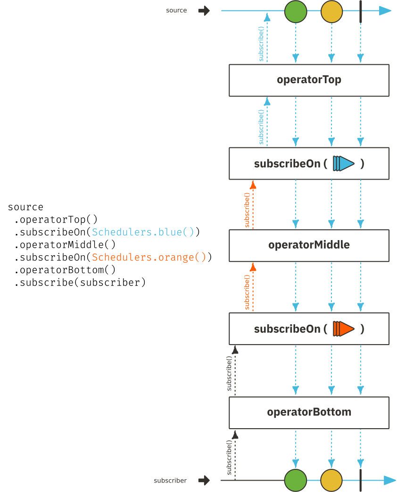

> NOTE: Tho I will be using [Project Reactor](http://projectreactor.io){:target="\_blank"} based examples in this article, these should be very familiar to those who work in [Rx Java2](https://github.com/ReactiveX/RxJava){:target="\_blank"}

In this article lets look at how `subscribeOn` & `publishOn` works. We will also understand why downstream values will always be emitted by the scheduler specified by top most `subscribeOn` when multiple `subscribeOn`s are specified in the operator chain

Before we even tackle anything lets understand the basic lingo in reactive streams

1. **Stream**: At an abstract level, a stream is nothing but an event stream. At its bare minimum, a stream is nothing but a chain of callbacks. at Project reactor & RxJava call the methods on streams () as operators. that modify the stream as an `operator`. These operators are generally found in `Flux` & `Mono` classes (Correspond to `Flowable` & `Single` in Rx Java). There are about ~400+ operators in these two classes alone

1. **Operator**: Project reactor & RxJava call the methods on streams () as operators. that modify the stream as an `operator`. These operators are generally found in `Flux` & `Mono` classes (Correspond to `Flowable` & `Single` in Rx Java). There are about ~400+ operators in these two classes alone

### How does `subscribeOn` work


`subscribeOn` is one such operator. The purpose of this operator as stated in the documentation is

```text
Run subscribe, onSubscribe and request on a specified Scheduler's Worker. As such, placing this operator anywhere in the chain will also impact the execution context of onNext/onError/onComplete signals from the beginning of the chain up to the next occurrence of a publishOn(Scheduler)
```

allowing the user to modify subscription time scheduler

Lets understand how `subscribe` method call is called all start with a sample code

```java
source
 .operatorTop()
 .subscribeOn(Schedulers.blue())
 .operatorMiddle()
 .subscribeOn(Schedulers.orange())
 .operatorBottom()
 .subscribe(subscriber)
```

The following marble diagram shows how the `subscribe` signal gets cascaded upstream from `subscriber` all the way till `source` thru intermediate operators



If you can observe in the marble diagram, the thread on which the `subscribe(subscriber)` gets executed is denoted in *black*{: .black-color} color & two `subscribeOn` schedulers (backed by threads) are represented in *orange*{: .orange-color} & *blue*{: .blue-color} color. Here is how everything works

1. As soon `subscribe` method is executed, the upstream `map(String::length)` operator gets subscribed to on the same black thread
2. This subscription continues up the chain till it encounters a `subscribeOn`, at this point the subscription switches from black thread & the further upstream subscriptions will continue using this new orange scheduler
3. A

Typically this scheduler switching is implemented using java `ExecutorService` based scheduler by submitting a task that does the upstream subscription using `orangeExecutor.execute(() -> upstream.subscribe())`

Now that we know how `subscribeOn` works, one of the question that comes to mind is, Since `subscribeOn` affects the subscription time scheduler, why not push this concern to `subscribe` directly. i.e why not update the `subscribe(Subscriber)` => `subscribe(Subscriber, Scheduler)`. This way the confusion regarding `subscribeOn` can be eliminated completely


This article is licensed under [Public Domain Dedication](https://creativecommons.org/publicdomain/zero/1.0/)
