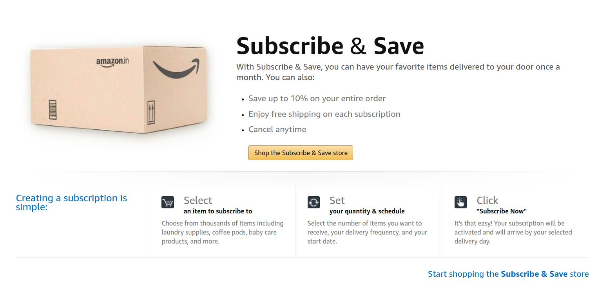

{:.featured-image.img-fluid.margin-auto}

_Disclosure: Please note that I am not an economist, not even a stock trader & have very limited understanding of economics in general._
_These are observations that I came up with._
_I want this to be an article that's alive so that new observations can be added & misunderstandings corrected_

I am an entrepreneur (_not yet successful_).
I would like to understand how business works.
The idea is to see if I can find places where I can add _value_

I recently came across this scheme introduced by Amazon India.
It works like this

1. You can schedule an item to be sent to you at regular intervals in the future (like a refill)
2. We can specify the frequency of this refill, say once every month, once every 3 months, e.t.c
3. We can also skip a refill for a given interval if we have not yet utilized the last once

For this, they give us a discount of upto 10% on all items in the future at the time of delivery

Once can say, this is a convenience tool from customer's point of view.
But I think there is much more than what meets the eye from Amazon's point of view

In this article I want to look at the business side of this

## Economics of scale to Monopoly exploitation

Amazon's major argument is, the cost to deliver a product
from producer to consumer can be reduced drastically,
if you can utilize logistics efficiently that comes with economies of scale

Sure, the argument per se has merit tho we all can see that
this will [hurt competition](https://mashable.com/2014/07/30/amazon-has-killed-publishers-they-just-dont-know-it-yet/)
in the long term, because they can suck large chunk of value
because they have created a virtual monopoly on customer info
as well as sucking most of the investment into their company
& buy/starve-off any small to medium scale competition 

This has impact on how "value extraction" works

Might help in logistics management
TODO: Betting on markets based on this exclusive information. How is this different from insider knowledge?
Pushing the price up by

We are moving Economies of scale argument to Monopoly exploitation 

{:.featured-image.img-fluid.margin-auto}

## Title

[{:.featured-image.img-fluid.margin-auto}](url){:target="\_blank"}

