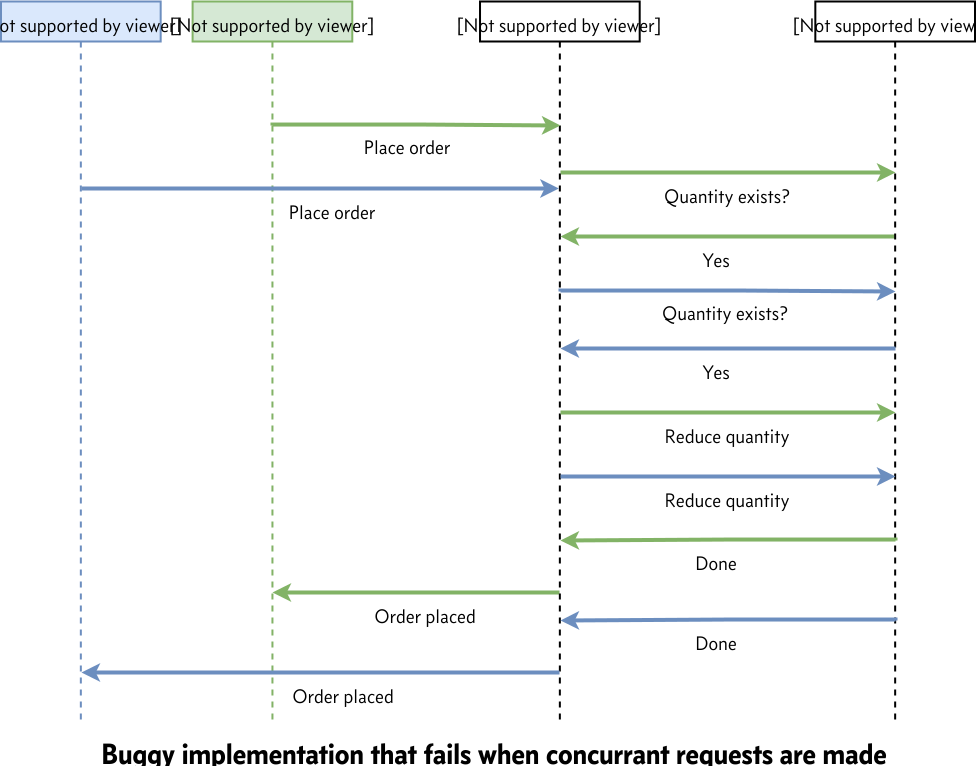
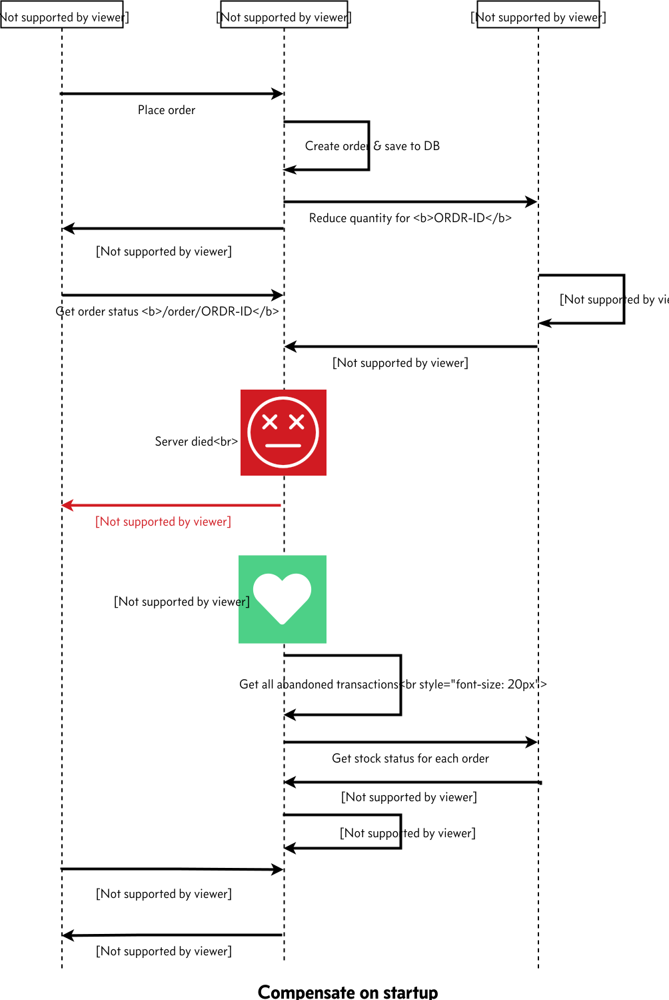
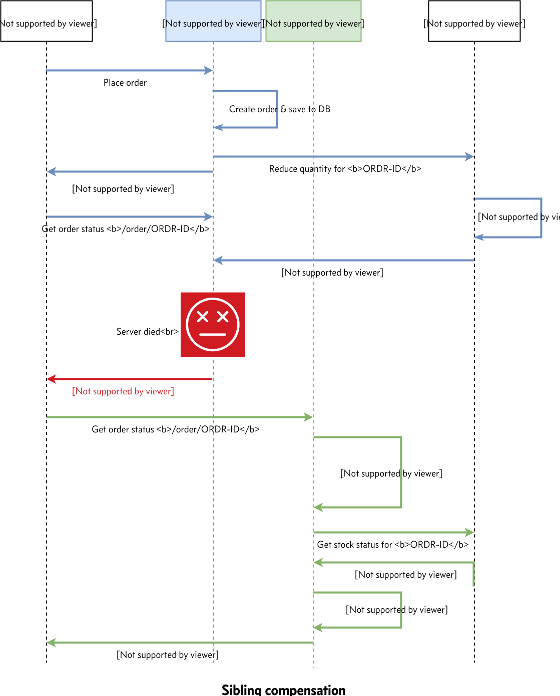

{:.featured-image.img-fluid.margin-auto}

This article addresses the consistency aspect in micro services environment where a transaction need to span more than one micro service

## Existing business usecase

Suppose that we currently have a monolithic order management system that is backed by a RDBMS

### Business requirements

Our business expects us to give them the following guarantees

1. **Never accept an order if the inventory does not have enough stock**
2. **Every item in the inventory is either assigned to an order (or) available for further purchases by customer within a reasonable amount of time**

As every seasoned developer knows, Monolith is a heaven for systems that want consistency because of RDBMS & the ACID guarantees it provides. But this comes at the cost of autonomy & scalability

Because of ACID guarantees, when we update both order & inventory tables, either the transaction succeeds (or) fails atomically. Because of this, it is easy to ensure 

> **Total inventory** = **Amount of stock left in inventory** + **quantity used up by previous orders**

In essence, its relatively easy to fulfill this requirement in our monolithic world since we will be working against a single database

> Please note that most of the businesses will be OK if we oversell items even when we don't have corresponding stock in the inventory. This is because once the order is placed, the business can ask vendors to send it more stock of the oversold items & still fulfill our customer's order. The point this article addresses is "can the technology live within business constraints"?. Suppose our business does not permit overselling because we are selling rare items, say classic paintings/some other exclusive items, which means we cant oversell as no other vendor can supply additional stock of all items in our inventory

## Breaking monolith

Suppose we chose micro services for achieving autonomy in terms of scalability/development velocity/release schedule, e.t.c, it follows that we can't share a single database across all of these micro services. Sharing database across micro services forces each team to coordinate with other team as soon as database schema needs to change, which defeats the whole purpose of micro services

Each type of micro service (can have any number of instances) will have to have its own private datastore. In other words, multiple instances of the same service type share a single database, but this database is never shared across micro services

After we identified our [bounded contexts](https://martinfowler.com/bliki/BoundedContext.html), we came up with the following breakup of our monolith into two micro services namely

1. `order-service` whose responsibility it is to accept customer orders
2. `inventory-service` whose responsibility it is to allow changes to inventory by both order service & also by our own internal inventory team

{:.featured-image.img-fluid.margin-auto}

At first glance, fulfilling this business requirements in micro services does not look that hard

We can make `order-service` call to `inventory-service` to check if sufficient stock exists to fulfil the order. If stock is available, reduce the given quantity of stock & permit the order to go thru. If not, deny the order

{:.featured-image.img-fluid.margin-auto}

But any seasoned developer will tell you it is not that simple (and I would not have written this article if it was this simple)

## Problem with concurrent transactions

Suppose two different users try purchasing the same item simultaneously when not enough stock exists to fulfill both the orders. If proper care is not taken at `inventory-service` level, we might allow both orders to succeed, even tho we don't have enough stock to fulfill both

{:.featured-image.img-fluid.margin-auto}

As any one who is familiar with concurrency control will tell us, why doesn't `inventory-service` reject the second request by utilizing [optimistic concurrency control](https://www.wikiwand.com/en/Optimistic_concurrency_control) (or) [pessimistic concurrency control](https://blogs.msdn.microsoft.com/marcelolr/2010/07/16/optimistic-and-pessimistic-concurrency-a-simple-explanation/)

Once we apply this fix, if two users attempt simultaneous purchase only one of them would succeed if fulfilling both orders results in stock becoming negative

{:.featured-image.img-fluid.margin-auto}

## Problem with server failures

Even with the above solution, we are still left with a problem
 
When it comes to servers on which our application runs, no one can guarantee that the hardware never fails. So server failure is a given. Every application must keep this in mind & should be resilient to these failures

What if `inventory-service` reduced the quantity in its database & `order-service` dies before it commits to its database?

{:.featured-image.img-fluid.margin-auto}

Now we are left with an interesting situation where we have missing inventory from the system because the server crashed. Welcome to **DATA INCONSISTENCY**

## Going back to drawing board

Now we know business will be really unhappy because even though we have unsold physical inventory, its missing in the software because one of our server crashed in the middle of the transaction

There are multiple ways this problem can be addressed. In this article I will present one way of addressing this

In the previous approach, `order` will be either in `confirmed`/`rejected` state & the client is stateless

But in our new approach

1. Order will have three states namely `initialized`, `confirmed` & `rejected`
2. And our client would be Stateful
3. In addition, the client will follow [Redirect after POST](https://www.theserverside.com/news/1365146/Redirect-After-Post) pattern

The reason for this redirect is because when client encounters a failure like the one in previous scenario, we don't want the client to retry the operation & place multiple orders for the same cart because user refreshed his browser. The previous pattern avoids this situation completely

Given that, here is our new approach

1. As soon as a request is received, `order-service` saves an order with status `initialized` to its own db
2. Immediately, `order-service` will make call to `inventory-service` with the `<order id>` and additional item info to reduce the stock in a background thread with an exclusive [row level lock](https://www.percona.com/blog/2018/10/16/postgresql-locking-part-1-row-locks/) on the newly created order
3. `order-service` responds to the client with HTTP `202 Accepted` (if API based client)/`302 Found` (if browser) response with a link to check the status of the order thru http `Location` header
4. If background order placement succeeds, `order-service` will update the status of the order to `confirmed` & releases row level lock on the order
5. If not, `order-service` will update the status of the order to `rejected` & releases row level lock on the order
6. Once client sees above `202`/`302` response, it will redirect the user to order status page (incase of browser) so that browser refreshes does not cause duplicate orders. Its a best practice to show loading screen while the order is being processed
7. Finally, `order-service` would respond to the order status request with `initialized`/`confirmed`/`rejected` status
8. If the order is not yet concluded, latest status can be obtained by client using polling/server can implement [long polling](https://www.wikiwand.com/en/Push_technology) to avoid client putting too much polling load

From point `(2)` of the mechanism above, in normal flow, `order-service` takes an `exclusive row level lock` over the order row and releases only once the transaction is concluded

If server crashes in the middle, this lock on that order row would be be released immediately by database

We will use this aspect to make sure that we dont interfere with the transactions that are currently in progress, when we try to reconcile/compensate (will be discussed later)

Now back to the crash issue in `order-service`

Since crash leaves our data in inconsistent state, `order-service` will have to explicitly **reconcile**/**compensate** for these failures at the application level by fetching the latest status of the order from `inventory-service` for abandoned orders. This is why its called `Compensating Transaction`

Compensation guarantees order status to be consistent with the business rules **EVENTUALLY**, but not immediately

Depending on how soon we want this reconciliation, we can implement reconciliation in the following three stages

1. Startup reconciliation: Orders abandoned before the instance is started are guaranteed to be consistent once the instance is up (optional)
2. On demand reconciliation: Orders requested by client are guaranteed to be consistent once the request is processed successfully (optional)
3. Scheduled reconciliation: Orders that are abandoned before the scheduler ran are guaranteed to be consistent once scheduler runs successfully (mandatory)

The guarantees each of the above three reconcilers provides are only valid for those orders for which the reconciler can acquire exclusive lock. If some other instance's reconciler is doing compensation for any given order, the current reconciler just skips over them

Now lets look at each one of these options & how the reconcilation/compensation works

### Startup reconciliation

This type of reconciliation guarantees that all the orders that were abandoned before the startup of the instance are guaranteed to be consistent once application is up

Suppose that `order-service` crashed in the middle of a transaction (abandoned). Instance can be brought back online manually/using kubernetes/some other mechanism

Here is what we should do as part of `order-service` startup to meet above guarantee

* `order-service` have to check if there are any orders in `initialized` state
* Attempt to acquire exclusive row level lock on each of the above orders. If lock cannot be acquired, just skip over it as this order is current being processed by some other instance
* For each of the above order on which lock can be acquired, `order-service` will request `inventory-service` about the latest status of the stock consumed by the given `<order id>`
* `inventory-service` will return latest status, which `order-service` will use to update in its own database

This way, `order-service` guarantees all orders that were abandoned before the startup will be consistent after startup

{:.featured-image.img-fluid.margin-auto}

### On demand reconciliation

Implementing this gives a guarantee that any abandoned order/transaction will be reconciled on the subsequent status request for that given order. Note that this only reconciles one specific order, not all abandoned orders

The way this works is, as soon as we receive a request for order status
 
1. `order-service` will get the status of the order from local db
2. If status is `initialized`, attempt to acquire exclusive row level lock
3. If row level lock cannot be acquired (some other instance is working on this), then wait till exclusive row level lock can be acquired on the order
4. Once lock is acquired, check if status is still `initialized`. If true, move to step (5), else return latest status
5. `order-service` will request `inventory-service` about the latest status of the stock consumed by the given `<order id>`
6. `inventory-service` will return latest status, which `order-service` will use to update in its own database & release exclusive row level lock

Suppose that we have two instances of `order-service` & the 1st instance is handling the order request & the server crashed midway just like before. When the client resends order status request (clients are expected to do this on a best effort basis), it will be received by the second instance, at which point, we can do compensation logic for the abandoned order as part of this request. This way client does not have to wait till the scheduled reconciliation for get the latest status (next section)

{:.featured-image.img-fluid.margin-auto}

### Scheduled reconciliation

This type of reconciliation guarantees that all the orders that were abandoned before the start of the current run of scheduler are guaranteed to be consistent once scheduler run is complete

Since relying on client to reconcile all orders that were failed midway is not a good idea as the client might never be able to contact the server due to network issue or some other reason, we want a mechanism within the application itself that does auto reconciliation at regular interval. This is where scheduled reconciliation comes in

At regular interval we have to [schedule a task](https://docs.spring.io/spring/docs/current/spring-framework-reference/integration.html#scheduling) to be run within our application that does the reconciliation

For each run of the scheduled task, this is what the reconciler does

* `order-service` will fetch all orders that are in `initialized` state
* Attempt to acquire exclusive row level lock on each of the above orders. If lock cannot be acquired, just skip over it as this order is current being processed by some other instance
* For each of the above order on which lock can be acquired, `order-service` will request `inventory-service` about the latest status of the stock consumed by the given `<order id>`
* `inventory-service` will return latest status, which `order-service` will use to update in its own database & release exclusive row level lock

{:.featured-image.img-fluid.margin-auto}

## Conclusion

We looked at one approach by which we can achieve resiliency in our application even under server crashes & any intermediate failures

In order to achieve that, we needed

1. Stateful client
2. Compensating transactions/Reconcilers at various levels

We looked at three types of reconciliations
 
* Startup reconciliation
* On demand reconciliation
* Scheduled reconciliation

It is important to note that each application must have Scheduled reconciler as this guarantees regular reconciliation & is not dependent on external actors. The other two types of reconciliations are optional but preferred

In a typical application, you would have all three reconcilers to reduce the amount of time the system will be in inconsistent state in case of unexpected failures

If you have any queries/suggestions let me know in the comments section
