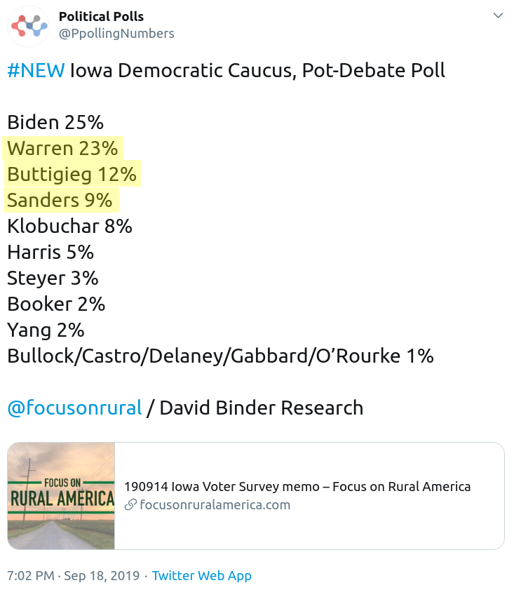
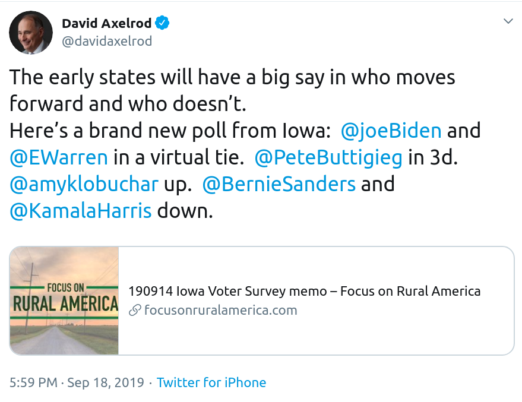
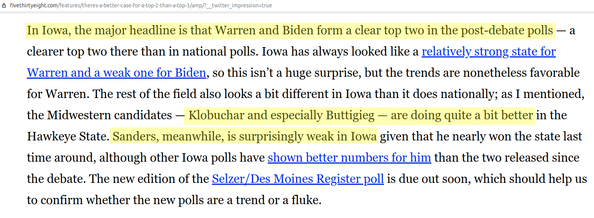
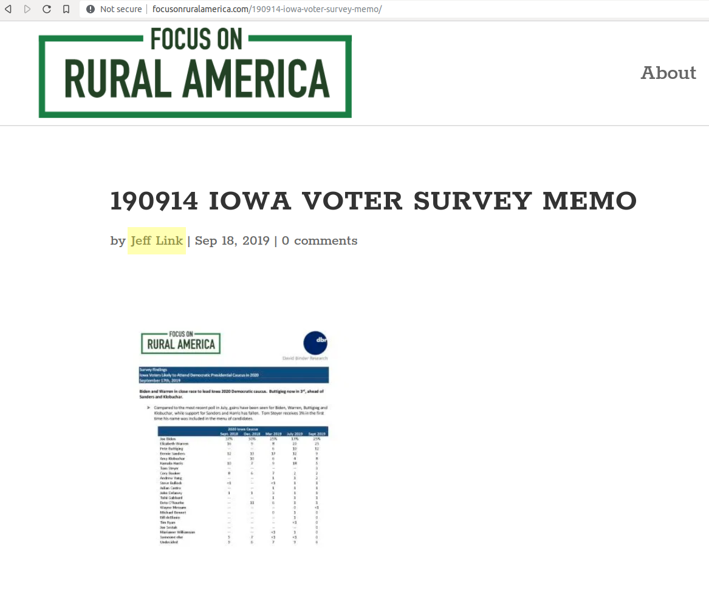
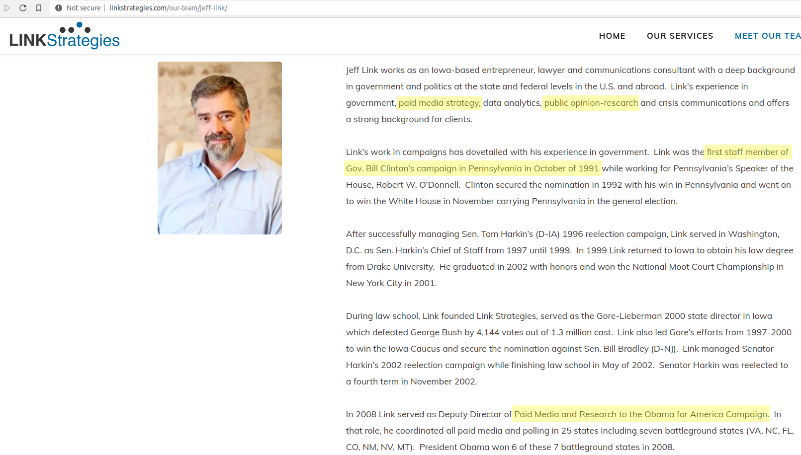
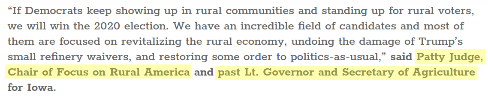
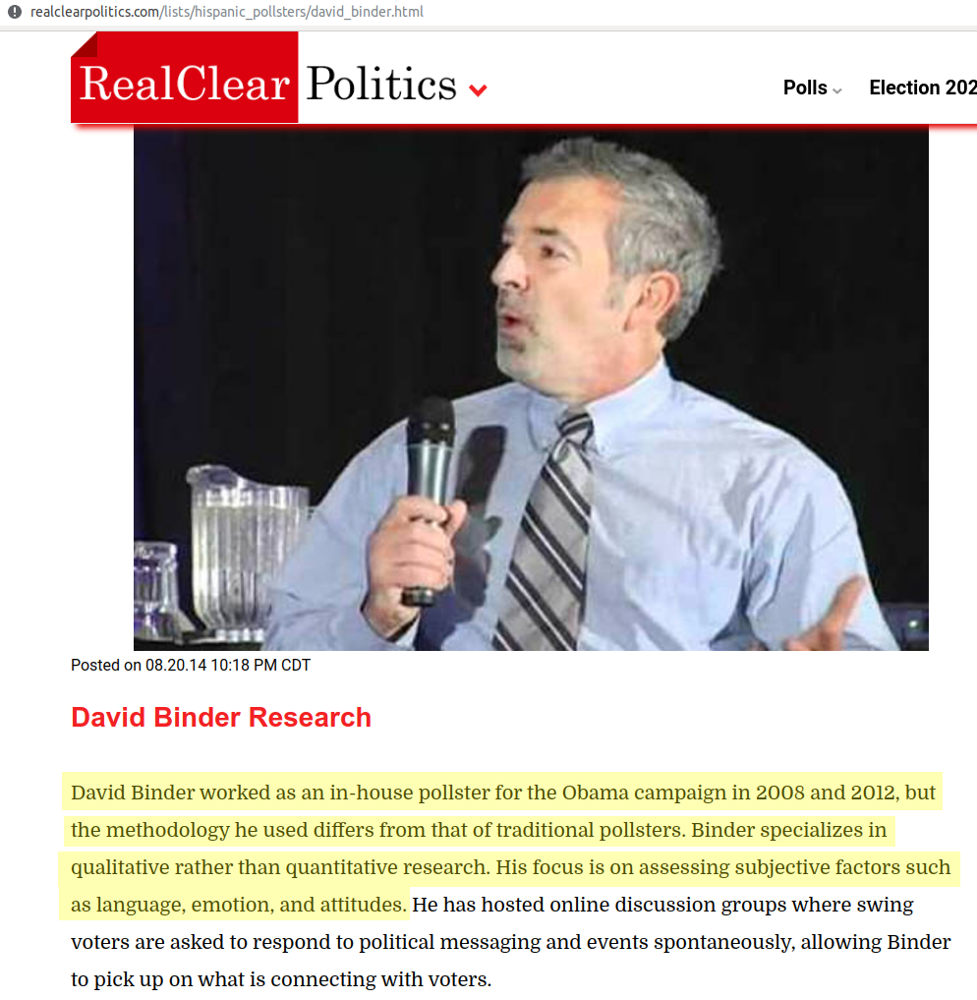
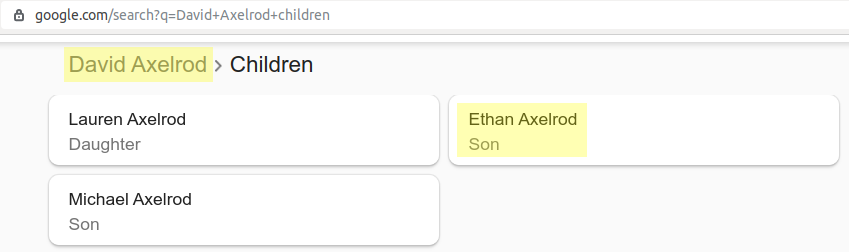

{:.featured-image.img-fluid.margin-auto}

> If voting could change anything it would be made illegal!
> 
> — Anonymous

*Manufacturing consent* has been the modern means by which the *few powerful* gets to control the *many powerless*.
Since *the many* won't give up their power so easily, the powerful must find new ways of convincing *the many* —
that the candidate of their choice does not enjoy popular support — so they must pick a more *reasonable choice*
to rule over them

In this article, I will attempt to convince you with publicly available data that
Democratic party insiders are trying manufacture consent in the current 2020 Democratic primary
season. Specifically, they are trying to prop up the candidates of their choice — Joe Biden, Elizabeth Warren & Pete Buttigieg —
while undermining Bernie Sander's candidacy thru self-serving "poll"s

Many of the pollsters use a statistically sound polling methodology,
which they then publish along with the results. We might disagree with the methodology (or) the
demographic selection, but we atleast have these details before taking commenting on
whether the poll is legitimate or not

We now have a new phenomenon where a pollster that neither publishes their methodology,
nor demographics, but publishes just the summary/memo of which candidate
gets what percentage of votes. This memo is then picked-up by mainstream media to run
non-stop propaganda with no questions about the credibility of the poll

This is the story of one such dubious organization — which is packed with establishment operatives —
that publishes polls that are highly questionable at best, outright corrupt at worst

## Background

If you paid attention to news lately, you would notice media telling
everyone that *Bernie is falling* while *Warren is surging*

To this end, I would like to focus on one of the recent polling published
by an organization called **Focus on Rural America**. I'll refer to this organization as *FORA* from now on

[{:.featured-image.img-fluid.margin-auto}](https://twitter.com/PpollingNumbers/status/1174315218593341440){:target="\_blank"}

Here are some of the media outlets that picked the poll put out by *FORA*

1. [New poll finds Biden, Warren in virtual tie in Iowa](https://thehill.com/homenews/campaign/461896-new-poll-finds-biden-warren-in-virtual-tie-in-iowa){:target="\_blank"}
2. [New Iowa Poll Finds Warren Surging, Sanders Fading, and Biden Leading](https://www.politicususa.com/2019/09/18/iowa-democratic-poll.html){:target="\_blank"}
3. [Joe Biden edges Elizabeth Warren in Iowa, Pete Buttigieg in third: Poll](https://www.washingtontimes.com/news/2019/sep/18/joe-biden-edges-elizabeth-warren-iowa-pete-buttigi/){:target="\_blank"}
4. [Warren shows signs of broadening her base](https://thehill.com/homenews/campaign/462072-warren-shows-signs-of-broadening-her-base){:target="\_blank"}
5. [Presidential candidate Amy Klobuchar in Detroit hoping to build on Midwest momentum](https://www.fox2detroit.com/news/presidential-candidate-amy-klobuchar-in-detroit-hoping-to-build-on-midwest-momentum){:target="\_blank"}
6. [Dems fear another rural wipeout will reelect Trump](https://www.politico.com/story/2019/08/20/democratic-primary-rural-outreach-1469005){:target="\_blank"}

There are lot more outlets that picked up this poll. To see all of them go [here](https://www.google.com/search?q="focus+on+rural+america"&tbm=nws){:target="\_blank"}

And some political commentators have already picked this stuff & are spreading it among their followers

[{:.featured-image.img-fluid.margin-auto}](https://twitter.com/davidaxelrod/status/1174299432692719616){:target="\_blank"}

Also, polling pundits like *Nate Silver* have used this poll as a base to undermine Bernie's popularity — while singing priases of the *chosen one*, Elizabeth Warren

[{:.featured-image.img-fluid.margin-auto}](https://fivethirtyeight.com/features/theres-a-better-case-for-a-top-2-than-a-top-3/){:target="\_blank"}

Mainstream TV outlets like MSNBC already used these polls to draw inference about electability, drumming up propaganda

<iframe width="800" height="600" class="featured-image margin-auto" src="https://streamable.com/uz9a4" frameborder="0" allowfullscreen></iframe>

I am told that many other mainstream TV outlets also ran multiple segments based on this specific poll. I will update this post when I gets access to the footage

Since many legitimate media outlets & TV talking heads are taking this poll seriously to push an agenda, lets take a close look at the organization

## Uncovering the actors

Lets start with analyzing the credibility of this poll publisher *FORA*; specifically,

1. Who are behind it
2. Which pollster do they use
3. What polling methodology does the pollster use

If you go to [this link](http://www.focusonruralamerica.com/190914-iowa-voter-survey-memo/){:target="\_blank"}, You would notice that the poll is published by someone named *Jeff Link*

[{:.featured-image.img-fluid.margin-auto}](http://www.focusonruralamerica.com/190914-iowa-voter-survey-memo/){:target="\_blank"}

When you click on the Author's link, you get *The page you requested could not be found.*

[{:.featured-image.img-fluid.margin-auto}](http://www.focusonruralamerica.com/author/jeff/){:target="\_blank"}

[About](http://www.focusonruralamerica.com/about/){:target="\_blank"} & [Contact](http://www.focusonruralamerica.com/contact-us/){:target="\_blank"} page does not help us either

A different page on the website explains that *Jeff Link* is the co-founder of *FORA*

[{:.featured-image.img-fluid.margin-auto}](http://www.focusonruralamerica.com/2019/09/18/september-2019-poll-results/){:target="\_blank"}

Navigating the website does not give you anymore information about who this man is.
If you google for his name, you will find another website called [Link strategies](http://www.linkstrategies.com/our-team/jeff-link/){:target="\_blank"}.

It describes him as someone with expertise in *paid media strategy* & *public opinion-research*.
He was *ex-Bill Clinton* staffer & also ran *Paid Media and Research to the Obama for America Campaign* —
specifically — *he coordinated all paid media and polling in 25 states*.

[{:.featured-image.img-fluid.margin-auto}](http://www.linkstrategies.com/our-team/jeff-link/){:target="\_blank"}

The same post also mentions another person who holds the post of chair in *FORA*, namely **Patty Judge** who also happens to be *Past Lt. Governor and Secretary of Agriculture* for Iowa

[{:.featured-image.img-fluid.margin-auto}](http://www.focusonruralamerica.com/2019/09/18/september-2019-poll-results/){:target="\_blank"}

*Patty Judge* gave glowing views of *Elizabeth Warren* in Jan 2019 — a month after warren announced her candidacy to enter Democratic primary

[{:.featured-image.img-fluid.margin-auto}](https://www.macleans.ca/politics/washington/elizabeth-warren-haunted-by-ghosts-of-sexism-past/){:target="\_blank"}

Not just that, as recently as Jun 2019, she hung around warren during her visit to an ethanol factory in Iowa

[{:.featured-image.img-fluid.margin-auto}](http://www.focusonruralamerica.com/2019/06/13/warren-judge-tour-ethanol-plant/){:target="\_blank"}

Going over the past posts further gives a glimpse of who else are behind *FORA*

A post dating back to May 2017 lists a man named **Sam Roecker** as an Advisor.

[{:.featured-image.img-fluid.margin-auto}](http://www.focusonruralamerica.com/2017/05/30/new-nonprofit-seeks-boost-progressive-causes-rural-america/){:target="\_blank"}

His twitter profile says he worked as the state director for **John Hickenlooper** —
the same [*throw your hands up* Hickenlooper](https://edition.cnn.com/videos/politics/2019/07/30/cnn-democratic-debate-bernie-sanders-john-hickenlooper-trump-vpx.cnn){:target="\_blank"}
who was after Bernie in the recent presidential polls before [dropping out](https://www.newsweek.com/john-hickenlooper-withdraw-2020-presidential-race-1454440){:target="\_blank"}

[{:.featured-image.img-fluid.margin-auto}](https://twitter.com/SamRoecker){:target="\_blank"}

In summary, here are the people behind *FORA*
 
1. A co-founder, who worked for many Democratic establishment candidates in the past — Clinton, Obama & more
2. An advisor, who in the past worked for primary opponent of Bernie (Hickenlooper)
3. A chairman, who praises Warren (another opponent of Bernie) & hangs around with her during the current primary campaign

Even with all the establishment actors running the show, its possible that the poll published by them might still be a *credible* one — if the pollster conducted the poll in a scientific manner with a well defined methodology

So, lets look at the pollster & the polling methodology he employed to arrive at this "poll"

## Uncovering the pollster

On the last page of the [memo](http://www.focusonruralamerica.com/wp-content/uploads/2019/09/190914-Iowa-Voter-Survey-memo.pdf){:target="\_blank"},
it is mentioned that a pollster named **David Binder Research** has conducted these polls.
We will get back to the pollster lil later

[{:.featured-image.img-fluid.margin-auto}](http://www.focusonruralamerica.com/wp-content/uploads/2019/09/190914-Iowa-Voter-Survey-memo.pdf){:target="\_blank"}

We are only given access to the [memo](http://www.focusonruralamerica.com/wp-content/uploads/2019/09/190914-Iowa-Voter-Survey-memo.pdf){:target="\_blank"} of the poll —
from which — it is hard to get any idea about what questions were actually posed to the voters & what their answers were.

You are told vague things like

1. Percent with Positive Opinion
2. Ruled Out *vs* Actively Considering

They dont tell you how these voting percentages were arrived at —
how voters were selected — what their demographics are —
white/black/asian/native american, men/women, rich/middle class/working poor, old/middle aged/young —
what percentage of the potential voters were contacted over landline vs mobile.

Nothing. You get no details about these important factors

They simply have a four page memo, which has tables that says this is what we found.
Almost all polls atleast give detailed breakdown, voter criteria,
but this one does not even bother giving you that information.

It just shares the conclusions on what percentage of votes each of democratic primary candidate will get in Iowa

Now lets get back to finding who is behind *David Binder Research*

As per [Real clear politics](https://www.realclearpolitics.com/lists/hispanic_pollsters/david_binder.html){:target="\_blank"}, *David Binder Research* is run by a guy
named *David Binder*, who worked as an *in-house pollster for the Obama campaign in 2008 and 2012*

[{:.featured-image.img-fluid.margin-auto}](https://www.realclearpolitics.com/lists/hispanic_pollsters/david_binder.html){:target="\_blank"}

The most important aspect being

> Binder specializes in **qualitative** rather than **quantitative** research.
> His focus is on assessing **subjective factors** such as **language**, **emotion**, and **attitudes**

To me, all this word salad means only one thing.
He *mind-reads* potential voters when conducting his polling.
In simple terms, his polls capture *his fellings* about *voter's feelings* about politicians

I have never heard a worse way to describe a pollster than this.
Given that only the memo is published without the underlying dataset,
I am assuming that this poll is based on the **feelings** of *David Binder* staff
about which democratic candidate gets what percentage of votes in Iowa
in the upcoming democratic primary election

Also, when you look at the staff page of *David Binder Research*, one of the name caught my eye.
His name is *Ethan Axelrod*

[{:.featured-image.img-fluid.margin-auto}](https://www.db-research.com/#team){:target="\_blank"}

He is the son of *David Axelrod*, who happen to be the *chief strategist for Obama's presidential campaigns*

[{:.featured-image.img-fluid.margin-auto}](https://www.google.com/search?q=David+Axelrod+children){:target="\_blank"}

## Conclusion

An organization called *Focus on Rural America* —
that's founded by someone who worked for Bill Clinton, ran paid campaigns for  Obama —
that's advised by someone who worked as State director for Hickenlooper —
that's chaired by someone who has apparent allegiance to one of the Democratic primary candidates —
specifically — Elizabeth Warren — publish just memo of the poll where Bernie is getting lower vote share than *Pete Buttigieg*.

These polls are conducted by ex-Obama pollster —
with a staff member whose father worked for Obama as chief strategist —
publishes just memo of the poll —
with numbers that are complete outliers —
with no information on the methodology/demographic breakdown —
which then are picked-up by mainstream media —
use this poll to push free propaganda for Warren & other corporate dems —
while undermining Bernie's campaign —
till this propaganda becomes reality in the minds of undecided voters.

Most outlets that reported these finding did not mention that the
polling is done by people who worked for corporate democrats in the past &
are commissioned by people who are currently batting for Warren, a candidate in the current democratic primary

What else do you call this other than *Manufacturing Consent* by democratic establishment —
in connivance with their toadies in the mainstream media —
to push a corporate democratic candidate?

## Credits

Thanks to the following people for sharing some of the references used in this article

* [Greg C](https://twitter.com/greg06897){:target="\_blank"}
* [Clark](https://twitter.com/Clarknt67){:target="\_blank"}
