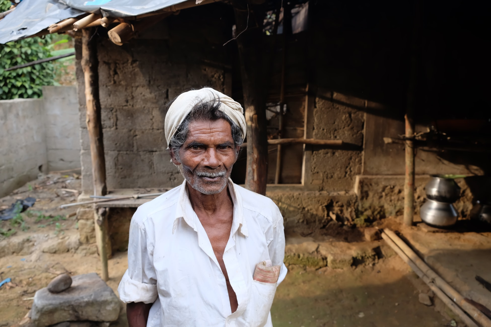

{:.featured-image.img-fluid.margin-auto}

Indian Govt led by fascist BJP is planning to conduct a country wide hunt for ["alleged"](https://theprint.in/opinion/with-assam-nrc-the-truth-is-also-out-it-was-a-pointless-exercise-all-along/284929/) illegal immigrants with the unspecified intent of punishing the poor, illiterate & most importantly [Muslims](https://www.news18.com/news/politics/bjp-vows-to-strip-muslim-immigrants-of-vote-in-assam-1214700.html).
The primary goal is show people that they being in Govt can do whatever the hell they want to do to push the country towards [anti-secular](https://www.thehindu.com/news/national/karnataka/hegde-kicks-up-a-fresh-row-with-remarks-on-secularism/article22271584.ece?homepage=true) [Goonish Hindu state](https://hinduexistence.org/2017/05/18/remove-secular-from-constitution-to-make-bharat-as-hindu-state-togadia/) & we all can do nothing about it.
The whole exercise of National Register of Citizens (NRC) is a ploy to intimidate, discriminate, punish, steal the property of Muslims & the ultimate humiliation of making them stateless.

I'll explain everything I said here with sufficient documentory evidence in this article.
I will also give you evidence based reasons as to why we should oppose this fascistic move tooth & nail.

TLDR: I will boycott this fascist NRC & will not submit my documents for verification. You all should do the same & join street protests to oppose this. If enough of us boycott it, there is nothing they can do about it.

## Background

Indian Courts are fully compromised & these unaccountable black gowns of Supreme Court are the ones who imposed this cruel NRC on Assam & sat idle for more than 100 days while the [fundamental rights of Kashmiries are violated](https://www.livelaw.in/top-stories/kashmir-internet-shutdown-for-over-100-days-a-violation-of-right-to-life-submits-dushyant-dave-149949) thru military terror.
Congress, AAP & most of Indian opposition parties lost their balls long back & have no fighting spirit in them.
They are in no mood to fight for their own turf, let alone fighting for you, me & our Muslims brothers and sisters (or) any just cause.
None of them have thought leaders.
They are nothing more than power brokers who are interested in their power & none of the responsibilities that come with.
They are collaborators in the sinister majoritarian Hindutva anti-secular game played by the thugs of BJP, while looking the other way.
They ask people to vote for them in the name of Secularism by pointing at the Goon (BJP) is really Bad, instead of protesting on street & forcing the fascists to backdown.

Gandhi taught us how to fight foreign invaders thru non violence & non cooperation.
Its not that hard to fight these domestic fascist bullies who are children of Godse. 
When we all hit streets & tell them in one voice that we will boycott this domestic fascist move of NRC, there is nothing they can do about it.
The more you let a bully win, the more pain he inflicts on us all.
Our compliance & silence emboldens the bully even more.
Lets disabuse ourselves for once by telling the bully he can only bully us when we are divided, not when we are united.

Prime Goon aka Conman aka Modi is a [Coward](https://thewire.in/media/narendra-modi-press-conference).
He cant even take an [unscripted question](https://www.youtube.com/watch?v=NbOQa8p080A), cries like a baby when confronted by any real journalist & needs to [drink water](https://www.youtube.com/watch?v=G3PKuc9Nsb4) when anyone asks an unscripted question.
Just like his Guru Savarkar aka [Traitor](https://thewire.in/history/bhagat-singh-and-savarkar-a-tale-of-two-petitions) aka Coward the Great, these bullies are the most cowardly bunch you can ever encounter.
The more we sit silent, the more they do whatever the hell they want to do.

This is my call to all of you to hit the streets and oppose these fascist snakes that spew venomous communal poison on day to day basis, which are born in that snake pit RSS.

Here are the reasons why we all should oppose NRC everywhere. Both Online & offline. Most importantly offline, by hitting the streets.

## 1. Its plain unjust

Jurisprudence is found on the basic principle that the person is [innocent until proven guilty](https://en.wikipedia.org/wiki/Presumption_of_innocence).
In case of NRC, everyone is guilty until proven innocent.
This is the reversal of the role of burden of proof.
Instead of Govt proving someone is guilty, we all have to prove we are all innocent of the crimes we did not commit.
This is the law of despots who dont care for the suffering they inflict on others.
Its the opposite of justice.

Why should a whole country needs to prove they are not criminals?
This is a unreasonable & cruel standard & [Supreme Court of India imposed](https://www.telegraphindia.com/india/everything-you-want-to-know-about-the-nrc/cid/1352646) this cruelty on All of us.

>If a rape happens in a city, you dont ask all male members to come and prove they are not the rapists, rather Govt has the burden to go, find and ultimately prove who the actual guilty party is—with evidence—in the court of law.

Only in fascist unjust societies (kafkaesque) do everyone needs to prove that they not guilty of the crimes they did not commit

## 2. Its based on a proven lie

BJP & the poisonous tree from which its born, RSS have insisted Assam is overflowing with illegal [Bangladeshi Muslim immigrants](https://www.economist.com/leaders/2019/07/11/indias-hunt-for-illegal-immigrants-is-aimed-at-muslims).
Now, that Assam NRC is over, it has come about [the number of Hindus who forged documents is much higher than Muslims](https://thewire.in/government/hindus-muslims-forged-documents-nrc).
The whole lie of BJP fell on its face.

When their lie is fully exposed, sore losers of BJP wants to impose one more round of NRC on Assamese & also want all of us to prove that we are not illegals.
These fascists lied about [crores of illegal immigrants](https://www.outlookindia.com/magazine/story/india-news-even-hindus-are-illegal-immigrants-in-assams-ambitious-national-register-of-citizens-bjp-on-backfoot/302099).

Most of these people who are not yet in the register are yet to exhaust all their legal options.
Many of these people are not yet in the system because our system is so flawed.
Many of these people are Indians still because, very few people prior to 1980s have documentary evidence as we are not documentation based society historically.

## 3. Its a fascist wedge to humiliate Muslims, take over their property & make them stateless

Soon after becoming Chancellor, Hitler passed [citizen laws](https://encyclopedia.ushmm.org/content/en/article/anti-jewish-legislation-in-prewar-germany) that every German needs to prove they are "real" Germans thru blood & ancestry.
All those who could not prove they are with 100% documentary evidence & 100% blood lines were declared illegals.
They were subjected to violence, humiliation, sent to concentration camps, made stateless, their properties taken over by the fascist Germans & millions of jews finally paid the ultimate price with life.

The poisonous snakes of RSS who spout the most venomous communal poison on day to basis are founded by those who consider [Hitler to be a great man](https://www.thehindubusinessline.com/news/national/golwalkar-drew-lessons-from-hitlers-germany/article7924161.ece) & [Nazism to be a great philosophy](https://thewire.in/world/german-ambassador-walter-lindner-rss-headquarters).
These goons now want to do the same with Muslims & other minorities.
We should never sit idle & tolerate while these fascists impose this level of cruelty on our fellow citizens.

## 4. Needless misery of the most vulnerable

No good reason is provided to prove that India is overwhelmed with illegal immigrants & all evidence point in the opposite direction, i.e spite to punish Muslims.
I am from a village background & my village is not in a remote place in India.
Even then, I never had any documentation other than my 10th and 12th certificate as evidence of my existence even when I went to pursue my masters degree (I am an Engineer mind you).

Somehow now have to assume that the poor Poor & Illiterate somehow have documentary evidence dating as far back as 1980s, ~40years back to prove they were here before that?
Why? For what? Because a Hindu fascists want to use this as a wedge to further their bigotry & cruelty?

Most rich people have documentation from quite a long time because they had land & so held decent amount of documentation, but what about all those vulnerable people who live in slums without much documentation?
Most people in cities will have documentation when compared to villagers because villages operate on the principle of trust & does not require as much documentation.

This whole exercise is a ploy to punish poor, illiterate, slum dwellers, villagers, landless peasants, vagabonds, merchants, beggars, people who ran away from house, abandoned kids & more.
This exercise is to inflict needless misery on every one, especially the poorest amongst us.

## 5. NRC = Demonetisation 2.0

The naked emperor's Tughlaq decision of [Demonetisation](https://www.economist.com/finance-and-economics/2016/12/03/the-dire-consequences-of-indias-demonetisation-initiative) has [destroyed the whole economy](https://www.economist.com/finance-and-economics/2017/01/07/the-high-economic-costs-of-indias-demonetisation).
Neo Tughlaq even went so far as to [suppress this data](https://www.thehindu.com/opinion/op-ed/a-politically-inconvenient-data-nugget/article29214638.ece).
We are currently on our way to [economic depression](https://www.cgdev.org/blog/if-india-stopped-growing-would-imf-and-world-bank-say-so).
This Tughlaq have no right to impose one more Tughlaqi decision & unleash this level of cruelty on us all once again.

> Demonetization 1.0 destroyed financial fabric of this country, Demonetization 2.0 (NRC) will destroy the social fabric of this country & impose state terror into everyone's heart.

These Goons are doing everything they can to destroy the social fabric by inciting communal violence in UP, Rajastan & everywhere they rule.

NRC is a ploy to tell all of us that the Servant (Govt) is stronger than the Master (Democracy & Us all) & the master should be afraid of the servant.
We should never let that happen.
Hundreds died [needless death](https://www.forbes.com/sites/timworstall/2016/12/08/indias-demonetisation-kills-100-people-apparently-this-is-not-an-important-number/) standing in queues when the terror of Destination 1.0 was unleashed.
Many committed [suicide in Assam](https://www.ndtv.com/india-news/man-declared-foreigner-dies-in-assam-family-refuses-to-accept-body-2116629) because of NRC.

Why should our citizens pay the ultimate price because Modern Tughlaq is sitting in PM seat?

## 6. Ploy to distract from every other important issues

Shock & Awe is the tactic of fascists.
They unleash unimaginable pain on people (Shock) & while we are struggling to recover from that shock (Awe), they unleash another shock.
Kashmir is imposed on every one & while people struggle to get justice on that front, they are pushing one more cruel thing onto us.

When we are completely distracted with needless but life changing distractions, we will stop worrying about real important things & start worrying about these madeup crises.

Lakhs of crores of our money in Banks is looted & Prime Goon has forgave all these crooks by [writing off](https://indianexpress.com/article/india/india-news-india/bad-loan-financial-year-rti-rbi-bank-loan-raghuram-rajan-bad-loan-financial-year-rti-rbi-bank-loan-raghuram-rajan-1140000000000-bad-debts-the-great-govt-bank-write-off/) all these amount without any serious implications to those who screwed us.
The unemployment is unprecedented.
The farmer's lives are miserable.

Now, [profit making companies like BPCL](https://www.thehindu.com/news/cities/mumbai/bpcl-employees-to-protest-privatisation/article29685122.ece) will be sold to his friends Ambani/Adani.
Why should profit making companies be sold?
Do Ambani needs to build one more billion dollar house instead of us getting basic needs taken care of?
When out schools are so bad, when our roads are awful, when people go bankrupt if they have any serious illness because of hospital costs, when Govt have no money to build new hospitals, whats the need to give money to Ambani even more richer by selling him BPCL?

When we are distracted with this needless misery, these fascists can complete the transformation this country into a fascist shit hole.
When we are distracted with useless shit like this, we dont worry about the fact that we are being fucked from behind.

Thats the real plan.

## 7. Cost of implementation

Assam is a smaller state & there in order to conduct this moronic exercise of NRC, more than [~8000 crores was spent](https://nagalandtoday.in/editorial/2019/11/people-left-out-of-nrc-in-assam-spent-rs-7836-crore-for-hearings-rights-body-survey/), 65000 people workers were utilized & the whole state of Assam were forced to travel, collect documentation & suffer miserable avoidable suffering.
What about the lost productivity of all those who have to travel, wait in lines to prove they are not illegals?
Many of the people worker who verified the documents are teachers, yes, [teachers were asked to verify documents](https://twitter.com/RuhulAlam72/status/1197808864583802880) instead of teaching kids.

Now the Goons sitting in Delhi wants to conduct one more round of NRC in Assam along with rest of India.
What about all the money that was spent in Assam?
Who cares?

The goal of fascists is replaying the game until they win, no matter the consequences to rest of the society.
Assam is a small state with a population of [~35 million people](https://indiapopulation2019.com/population-of-assam-2019.html) & they spent roughly 8000 crores in aggregate.
How many crores will we need to spend on this cruel, unnecessary & immoral exercise across the whole country with a population of [~1353 Million](https://indiapopulation2019.com/)?

3 lakh crores?

For what?
So that the Tughlaq and this fascist regime can use us as pawn in their fascist political calculations?

Can we even begin to put a number on the misery of everyone who has to suffer thru this?

## Conclusion

Time for laughing at the jokes aimed at cowardly cruel criminal fascistic poisonous fools is over.
If we laugh at them even now, the joke is on us for letting Tughlaq implement this fascist NRC.
Lets follow Gandhi's footsteps & hit the streets to protest these fascist cowards.

If you have any suggestion/comment/criticism, feel free to post it in the comment.
